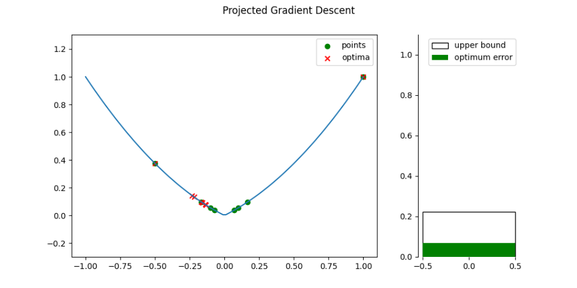

# About projected gradient descent

Simple vizualizations for:
- lipschitz
- lipschitz and alpha convex
- beta smooth
- beta smooth and alpha convex
Run `about_projected_gradient_descent.ipynb`.

References:   
- http://sbubeck.com/Bubeck15.pdf
- https://distill.pub/2017/momentum/